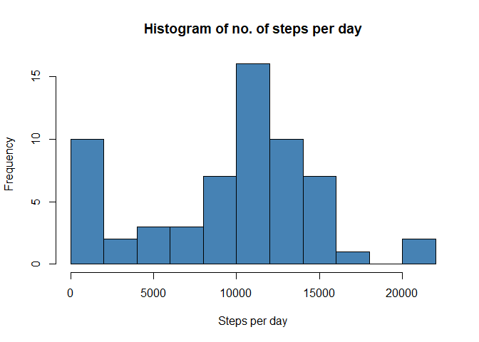
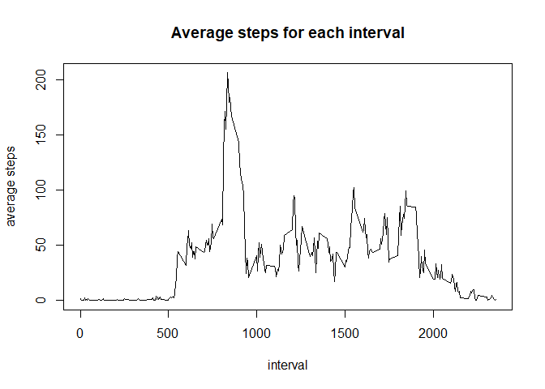
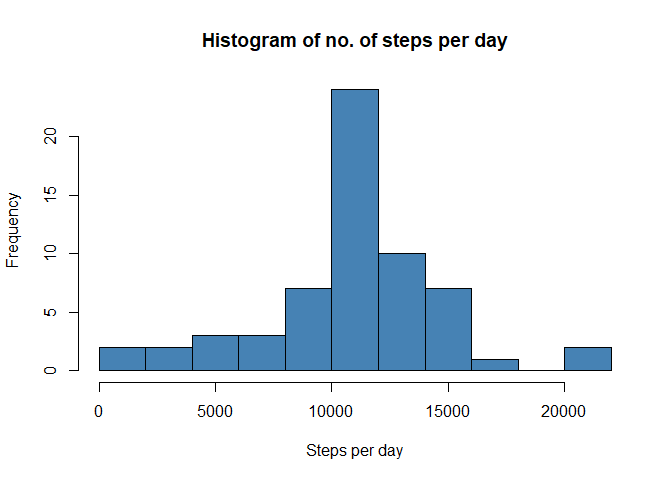
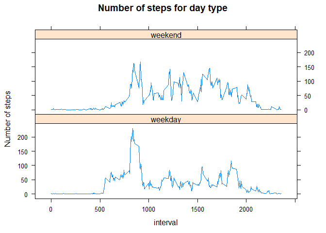

## Loading and preprocessing the data


```r
unzip("activity.zip")
d<-read.csv("activity.csv")
d<- transform(d,date=as.Date(date,"%Y-%m-%d"))
```


## What is mean total number of steps taken per day?


```r
day<- aggregate(d$steps,by=list(d$date),FUN=sum,na.rm=T)
names(day)<- c("day","steps")
hist(day$steps,breaks = 15,col = "steelblue",xlab = "Steps per day", main = "Histogram of no. of steps per day")
```

<!-- -->

```r
mean_steps<- mean(day$steps)
median_steps<- median(day$steps)
```

- **mean** of number of steps taken per day: 9354.2
- **median** of number of steps taken per day: 10395


## What is the average daily activity pattern?


```r
int<- aggregate(d$steps,by=list(interval=d$interval),FUN=mean,na.rm=T)
plot(int,ylab="average steps",type="l",main="Average steps for each interval")
```

<!-- -->

```r
max_interval<-int[int$x==max(int$x),1]
```

- the 5-minute interval with **max** steps on average: 835


## Imputing missing values


```r
naRows<-sum(is.na(d))
```

1- Total number of **missing values** in the dataset: 2304  
2- To impute `NA` values, we can use mean of steps for each day or for each interval.
we will try both and ckeck results.


```r
#impute using means for each interval
d_i_byinterval<-d
for(i in seq(1:length(unique(d$interval)))){
    di<- d[d$interval==(unique(d$interval)[i]),"steps"]
    di[is.na(di)==T]<-mean(di,na.rm=T)
    d_i_byinterval[d$interval==(unique(d$interval)[i]),"steps"]<-di
    }
#impute using means for each day
d_i_byday<-d
for(i in seq(1:length(unique(d$date)))){
  di<- d[d$date==(unique(d$date)[i]),"steps"]
  di[is.na(di)==T]<-mean(di,na.rm=T)
  d_i_byday[d$date==(unique(d$date)[i]),"steps"]<-di
}

#check NA values for byday way
sum(is.na(d_i_byday))
```

```
## [1] 2304
```

```r
#check NA values for byinterval way
sum(is.na(d_i_byinterval))
```

```
## [1] 0
```

- we can see that using mean for every day will still give `NA` values!  
That happens because some days have only `NA` values, so that we can't calculate the mean.
- Imputing for each interval give zero `NA` values,so that we will choose it for imputing.

3- Dataset with imputed values: `d_i_byinterval`

4- Histogram of no. of steps per day after imputing `NA` values:

```r
dayi<- aggregate(d_i_byinterval$steps,by=list(d_i_byinterval$date),FUN=sum)
names(dayi)<- c("day","steps")
hist(dayi$steps,breaks = 15,col = "steelblue",xlab = "Steps per day", main = "Histogram of no. of steps per day")
```

<!-- -->

```r
mean_steps<- mean(dayi$steps)
median_steps<- median(dayi$steps)
```

- **mean** of number of steps taken per day after imputing `NA`: 10766
- **median** of number of steps taken per day after imputing `NA`: 10766
- It's clear that after imputing `NA` values **mean** and **median** have increased!  
of course because `NA` values is replaced by *positive* values which is the mean of no. of steps for each interval.

## Are there differences in activity patterns between weekdays and weekends?

1- Introducing new variable `daytype`, to indicating whether the day is weekday or weekend.


```r
dd<- mutate(d_i_byinterval,date=as.Date(date,"%Y-%m-%d"),daytype=isWeekday(date))
dd$daytype<-factor(dd$daytype,levels=c("TRUE","FALSE") ,labels =c("weekday","weekend") )
```

2- Plot of the differences in activity patterns between weekdays and weekends:

```r
library(lattice)
ddi<- aggregate(dd$steps, by=list(interval=dd$interval,daytype=dd$daytype),FUN=mean)
xyplot(x~interval|daytype,ddi,layout=c(1,2),type="l",ylab="Number of steps",main="Number of steps for day type") 
```

<!-- -->


